# WSD Assignment 2 - Product Management REST API

## 프로젝트 개요

Spring Boot를 사용한 상품 관리 REST API 프로젝트입니다. 8개의 RESTful API 엔드포인트를 제공하며, 요청 로깅 미들웨어와 표준화된 응답 형식을 구현했습니다.

## 기술 스택

- **Java**: 17
- **Spring Boot**: 3.3.5
- **Spring Data JPA**: H2 In-Memory Database
- **Spring Validation**: Bean Validation
- **Lombok**: 보일러플레이트 코드 감소
- **Swagger/OpenAPI**: springdoc-openapi 2.6.0
- **Build Tool**: Gradle

## 주요 기능

### 1. RESTful API (8개 엔드포인트)

#### POST (2개)
- `POST /api/products` - 상품 생성
- `POST /api/products/bulk` - 대량 상품 생성

#### GET (2개)
- `GET /api/products/{id}` - 상품 조회
- `GET /api/products/search?name={name}` - 상품 검색

#### PUT (2개)
- `PUT /api/products/{id}` - 상품 정보 수정
- `PUT /api/products/{id}/stock` - 상품 재고 수정

#### DELETE (2개)
- `DELETE /api/products/{id}` - 상품 삭제
- `DELETE /api/products` - 전체 상품 삭제

### 2. 미들웨어 (Middleware)

**RequestLoggingFilter**: 모든 HTTP 요청을 로깅하는 필터 구현
- 요청 시간, HTTP 메서드, URI를 로그로 기록
- `[2025-11-10 14:30:45] GET /api/products/1` 형식으로 출력

### 3. HTTP 응답 코드

#### 2xx 성공
- `200 OK`: 조회/수정 성공
- `201 Created`: 생성 성공
- `204 No Content`: 삭제 성공

#### 4xx 클라이언트 오류
- `400 Bad Request`: 유효성 검증 실패
- `404 Not Found`: 리소스를 찾을 수 없음
- `409 Conflict`: 중복된 리소스

#### 5xx 서버 오류
- `500 Internal Server Error`: 서버 내부 오류

### 4. 표준화된 응답 형식

모든 API는 다음과 같은 표준 형식으로 응답합니다:

```json
{
  "status": "success",
  "data": {
    "id": 1,
    "name": "노트북",
    "price": 1500000,
    "description": "고성능 게이밍 노트북",
    "stock": 10,
    "createdAt": "2025-11-10T12:00:00",
    "updatedAt": "2025-11-10T12:00:00"
  },
  "message": "Product created successfully"
}
```

오류 응답:
```json
{
  "status": "error",
  "data": null,
  "message": "Product not found with id: 1"
}
```

## Swagger API 문서

### POST - 상품 생성
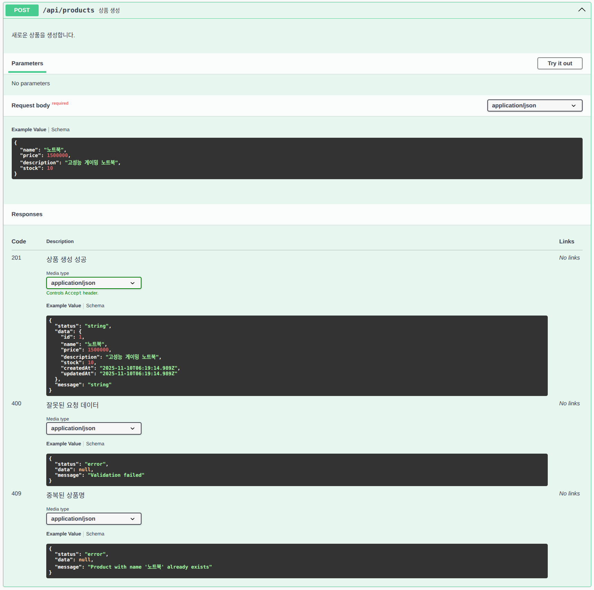

### POST - 대량 상품 생성
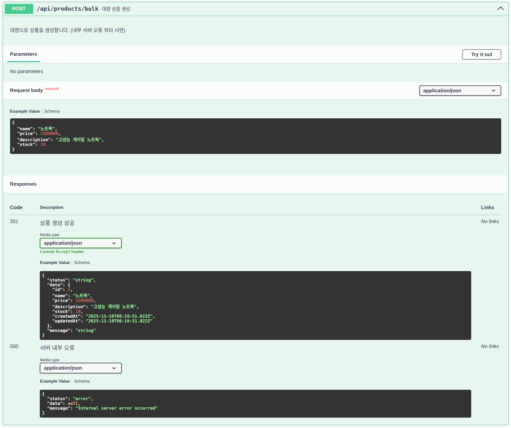

### GET - 상품 조회
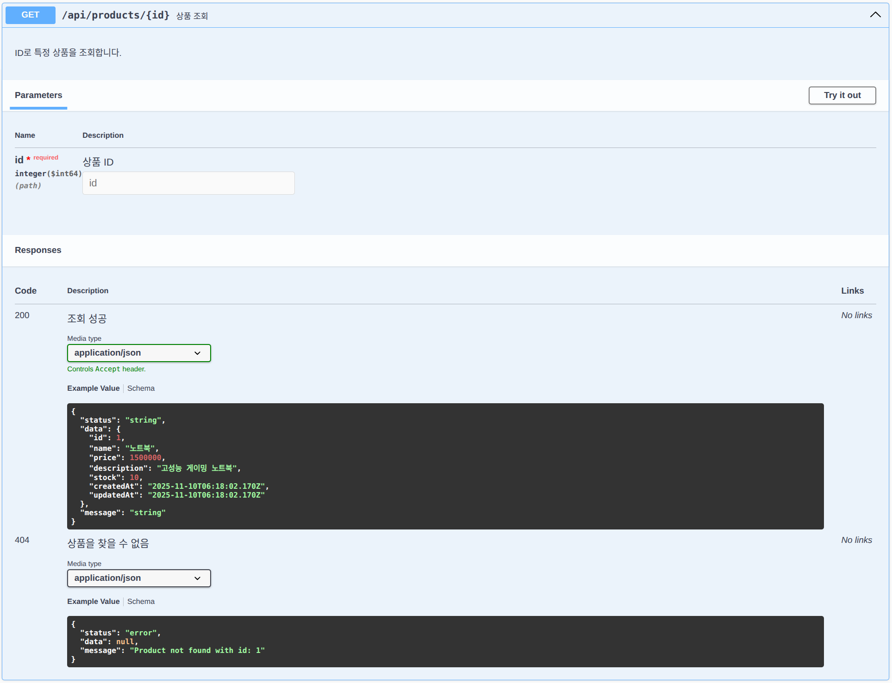

### GET - 상품 검색
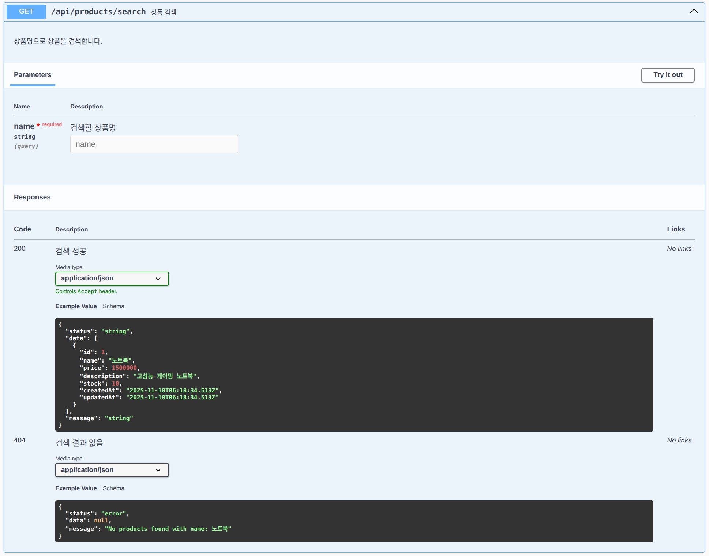

### PUT - 상품 정보 수정
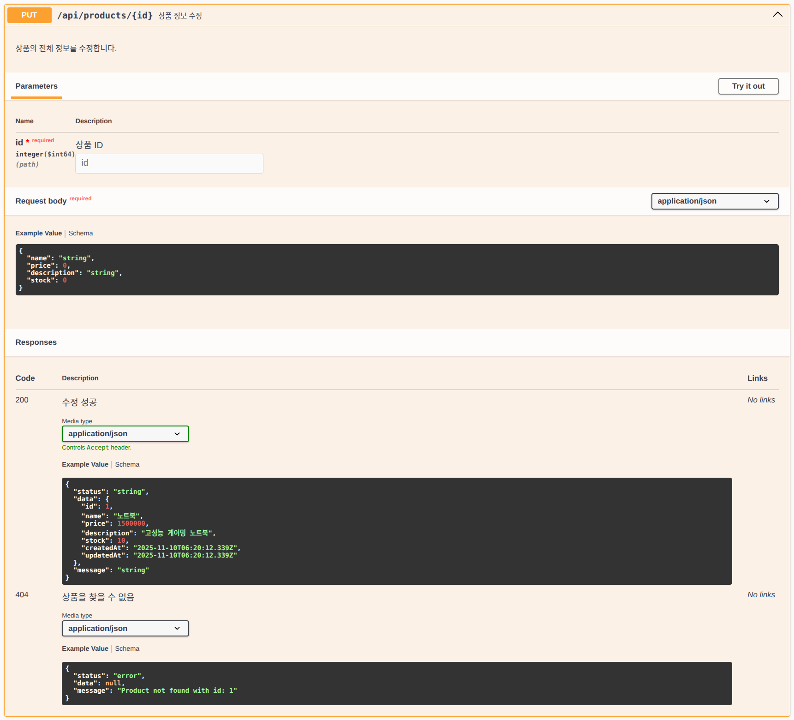

### PUT - 상품 재고 수정
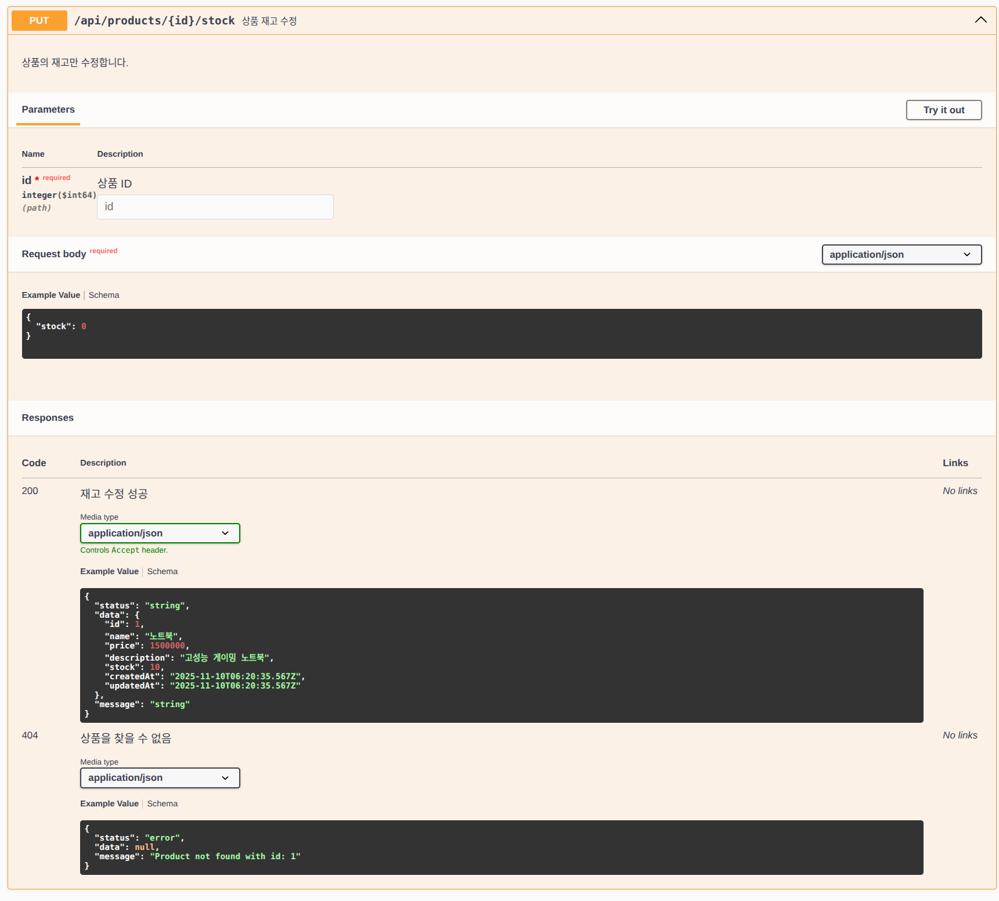

### DELETE - 상품 삭제
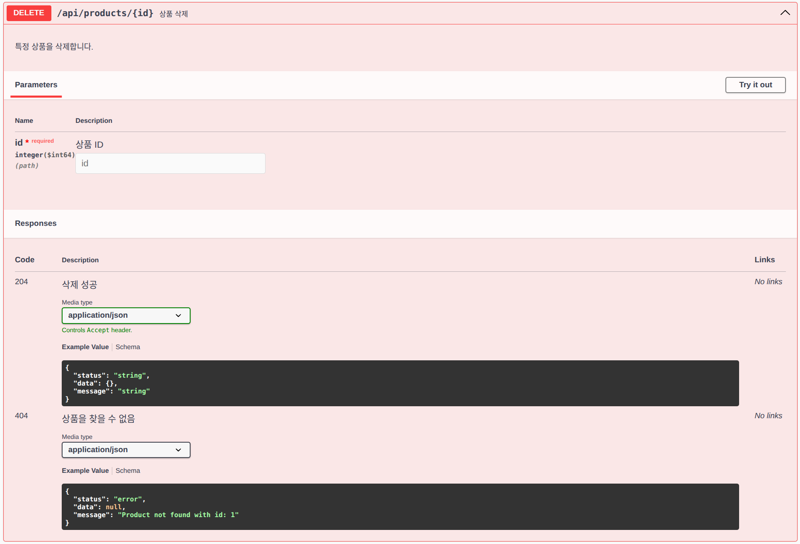

### DELETE - 모든 상품 삭제


## 요청 로그 예시

RequestLoggingFilter 미들웨어가 모든 HTTP 요청을 다음과 같은 형식으로 로깅합니다:

```
[2025-11-10 14:30:45] POST /api/products
[2025-11-10 14:31:12] GET /api/products/1
[2025-11-10 14:31:28] GET /api/products/search
[2025-11-10 14:32:05] PUT /api/products/1
[2025-11-10 14:32:30] DELETE /api/products/1
```

### 로깅 스크린샷

#### POST 요청 로그
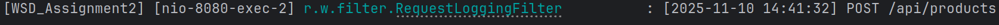

#### GET 요청 로그
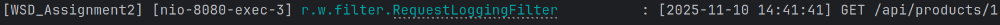

#### PUT 요청 로그
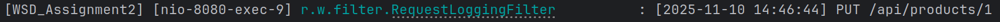

#### DELETE 요청 로그
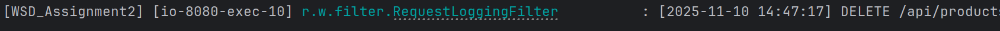

## 프로젝트 구조

```
src/main/java/rheon/wsd_assignment2/
├── common/
│   └── ApiResponse.java              # 표준화된 응답 형식
├── config/
│   └── SwaggerConfig.java            # Swagger 설정
├── controller/
│   └── ProductController.java        # REST API 컨트롤러
├── dto/
│   ├── ProductCreateRequest.java     # 상품 생성 요청 DTO
│   ├── ProductUpdateRequest.java     # 상품 수정 요청 DTO
│   ├── ProductStockUpdateRequest.java # 재고 수정 요청 DTO
│   └── ProductResponse.java          # 상품 응답 DTO
├── entity/
│   └── Product.java                  # 상품 엔티티
├── exception/
│   ├── DuplicateResourceException.java    # 중복 리소스 예외
│   ├── InternalServerException.java       # 서버 내부 오류 예외
│   ├── ResourceNotFoundException.java     # 리소스 미발견 예외
│   └── GlobalExceptionHandler.java        # 전역 예외 처리
├── filter/
│   └── RequestLoggingFilter.java     # 요청 로깅 미들웨어
├── repository/
│   └── ProductRepository.java        # JPA Repository
├── service/
│   └── ProductService.java           # 비즈니스 로직
└── WsdAssignment2Application.java    # 메인 애플리케이션
```

## 실행 방법

### 1. 프로젝트 빌드

```bash
./gradlew clean build
```

### 2. 애플리케이션 실행

```bash
./gradlew bootRun
```

또는 빌드된 JAR 파일 실행:

```bash
java -jar build/libs/WSD_Assignment2-0.0.1-SNAPSHOT.jar
```

### 3. 접속 확인

- **애플리케이션**: http://localhost:8080
- **Swagger UI**: http://localhost:8080/swagger-ui.html
- **API Docs**: http://localhost:8080/v3/api-docs
- **H2 Console**: http://localhost:8080/h2-console

## 데이터베이스

H2 인메모리 데이터베이스를 사용합니다.

### H2 Console 접속 정보
- **URL**: http://localhost:8080/h2-console
- **JDBC URL**: `jdbc:h2:mem:testdb`
- **Username**: `sa`
- **Password**: (비어있음)

## 검증 규칙

### ProductCreateRequest
- `name`: 필수, 공백 불가
- `price`: 필수, 0 이상
- `stock`: 필수, 0 이상
- `description`: 선택

### ProductUpdateRequest
- `name`: 필수, 공백 불가
- `price`: 필수, 0 이상
- `stock`: 필수, 0 이상
- `description`: 선택

### ProductStockUpdateRequest
- `stock`: 필수, 0 이상

## 예외 처리

| 예외 | HTTP 상태 코드 | 설명 |
|------|----------------|------|
| ResourceNotFoundException | 404 | 리소스를 찾을 수 없음 |
| DuplicateResourceException | 409 | 중복된 리소스 |
| MethodArgumentNotValidException | 400 | 유효성 검증 실패 |
| InternalServerException | 500 | 서버 내부 오류 |
